# Setup-a-master-slave-configuration-using-ansible
What is Ansible ?
      Ansible is an open source IT automation engine that automates provisioning, configuration management, application deployment, 
orchestration, and many other IT processes.It is free to use, and the project benefits from the experience and intelligence of its thousands of contributors.

1. Here, I'm going to setup a master to slaves node configuration.
   First I create one master machine, using Amazon linux.
   In user data , mentioned a several command to install a pip through python.

   
   

       #! /bin/bash
       yun install python-pip -y
       pip install ansible

2. Then , I create 3 slave machines as a same Amazon linux.

   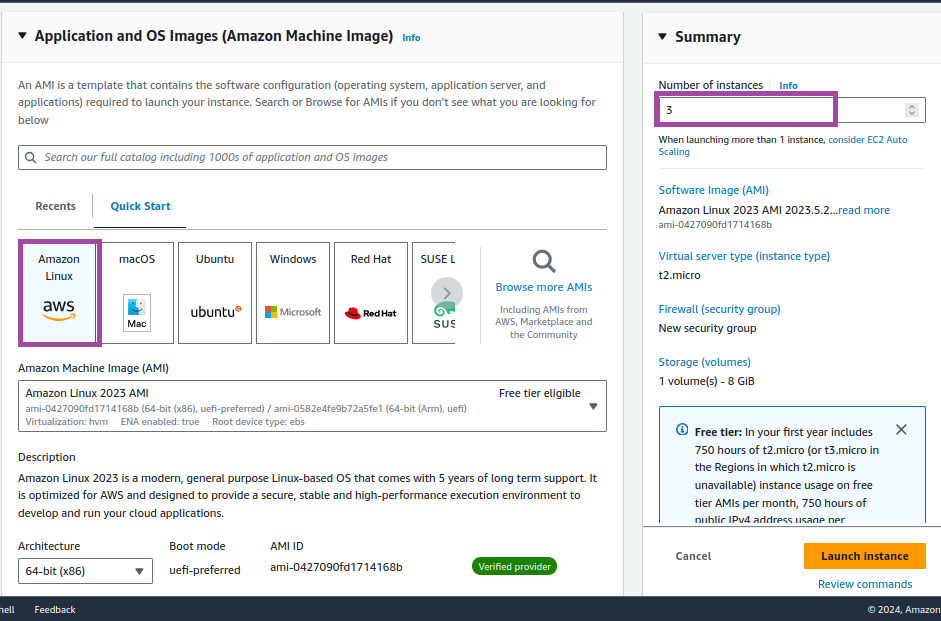
   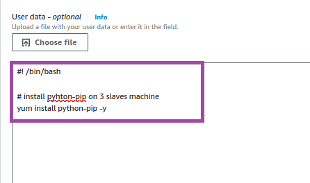

         #! /bin/bash
         yum install python-pip -y

3. Here, Every machines are working fine. I asign name as Master, One, two, three

      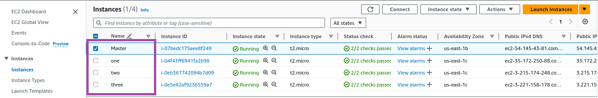

4. Using ssh ,I'm loging into my Master machine

   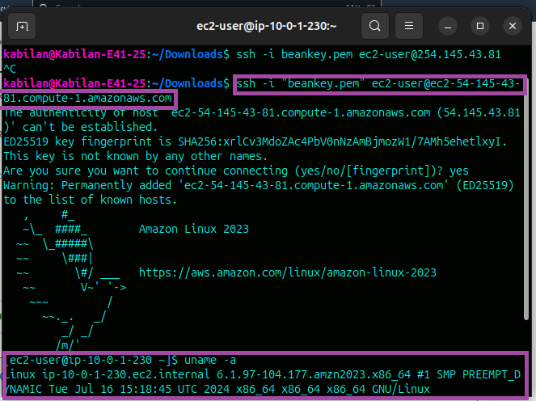

5. We should create a ssh-keygen for connect every 3 slaves machines. After created ,change dir to .ssh.
   Now , you can see a public and private key something.
   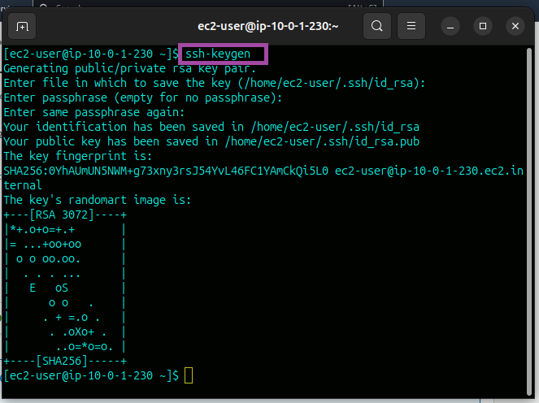
   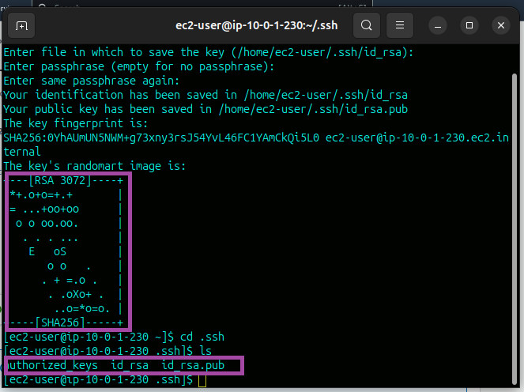

6. We should copy the id_rsa.pub to our every slave machines. Login to our any slave machine change dir to .ssh/authoeized_keys and
   copy a public #id_rsa.pub key what we created a key using keygen. If you using a windows os, you can use access a slave machine through pagent.

    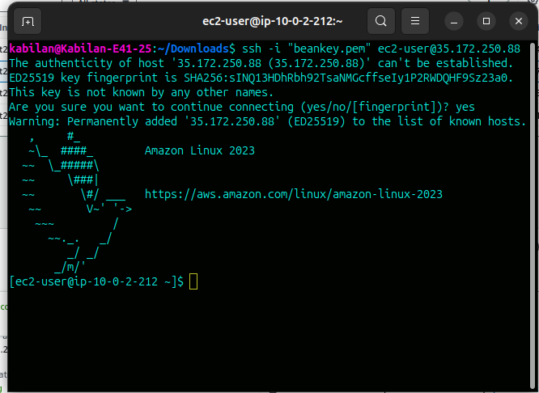

7. Now I'm able to connect our slave machine. Copy a key on every slave machines properly.
   
   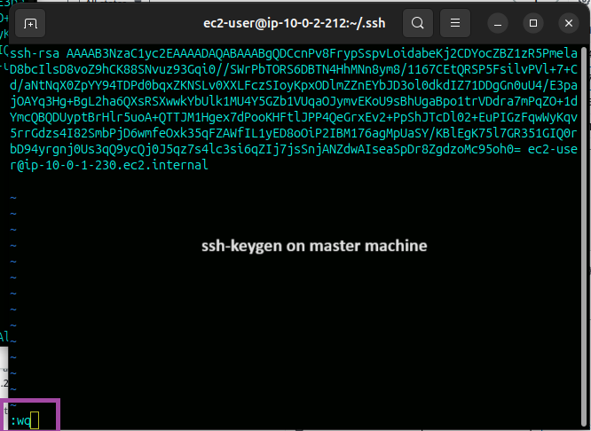
   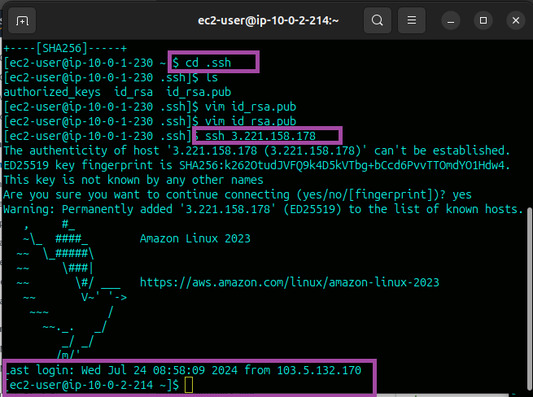

8. Create a slaves.txt on master machine, copy every slave machines private ip address.
   Why i am using private here ? means, often the machine will shutdown or no network connectivity. Then your public ip will chaged.

   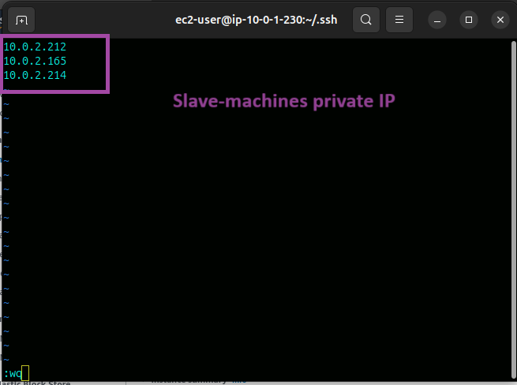

9. In ansible if we want to connect a save machine, should have a ansible configuration file.
   Using the command to download.

         wget https://gist.githubusercontent.com/alivx/2a4ca3e577ead4bd38d247c258e6513b/raw/fe2b9b1c7abc2b52cc6998525718c9a40c7e02a5/ansible.cfg

   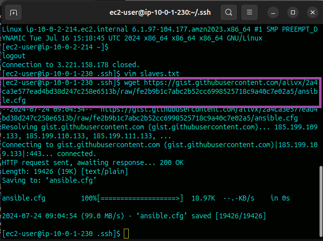
   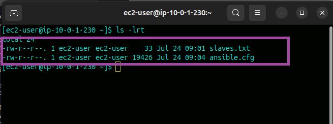

10. Try to connect a slaves machines.
    
          ansible all -i slaves.txt -m ping
    
    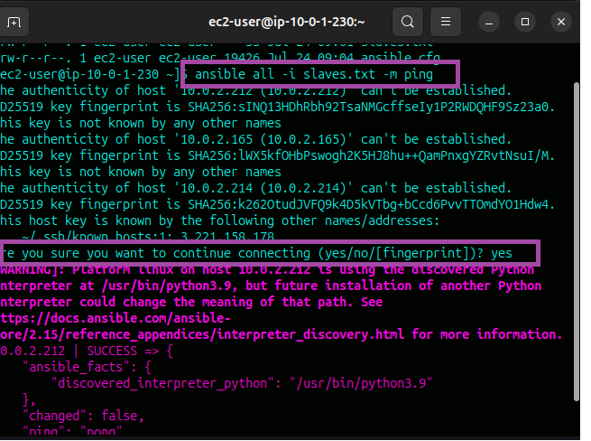

12. If you face any error, just change on your ansible configuration
    > ! Change the True
    > host_key_checking = False

    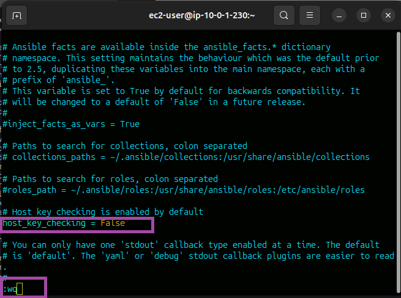

13. Now, try to acces your slave mchines you can

    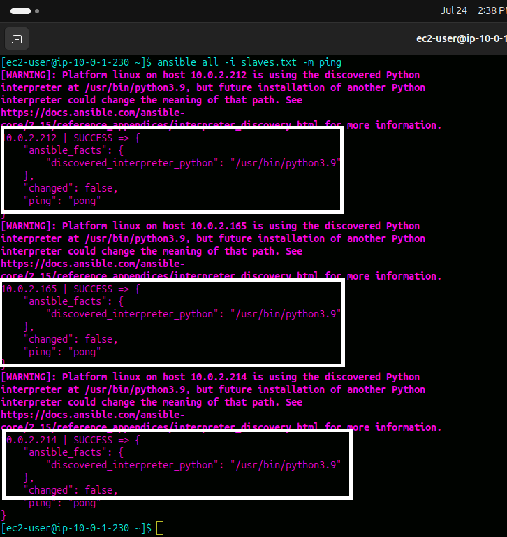

>                                                 Thank you............
   
