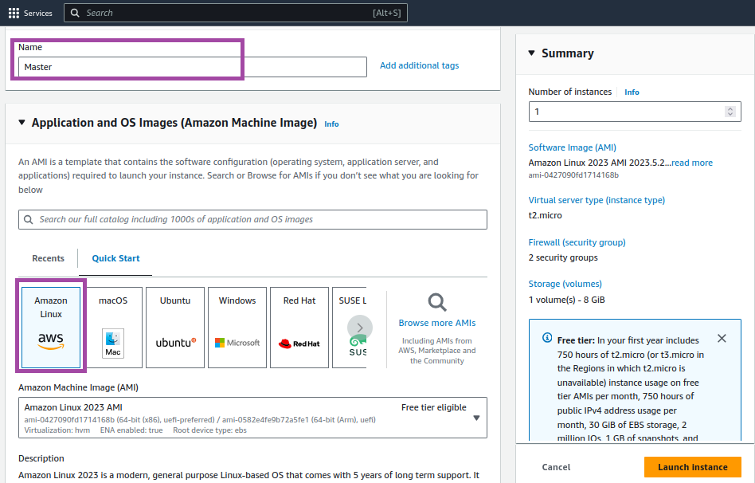
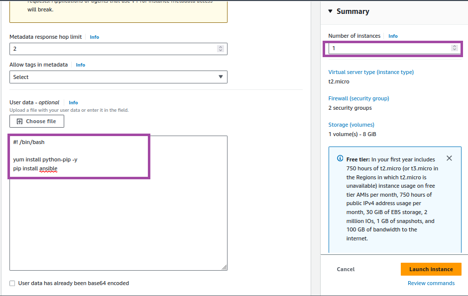

# Setup-a-master-slave-configuration-using-ansible
What is Ansible ?
      Ansible is an open source IT automation engine that automates provisioning, configuration management, application deployment, 
orchestration, and many other IT processes.It is free to use, and the project benefits from the experience and intelligence of its thousands of contributors.

1. Here, I'm going to setup a master to slaves node configuration.
   First I create one master machine, using Amazon linux.
   In user data , mentioned a several command to install a pip through python.

   
   

       #! /bin/bash
       yun install python-pip -y
       pip install ansible
   
